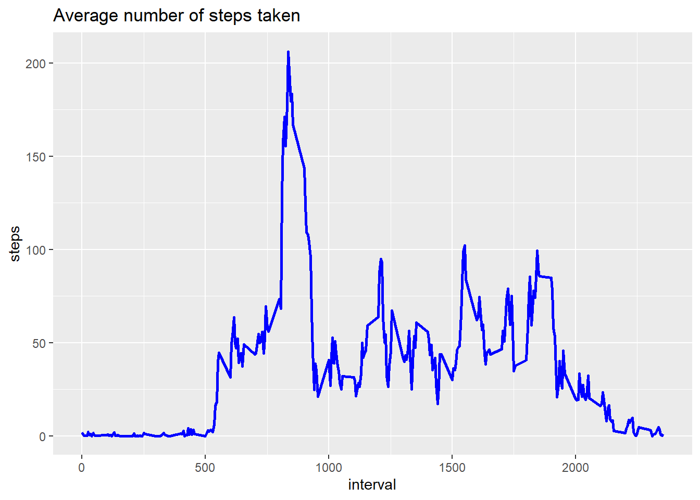
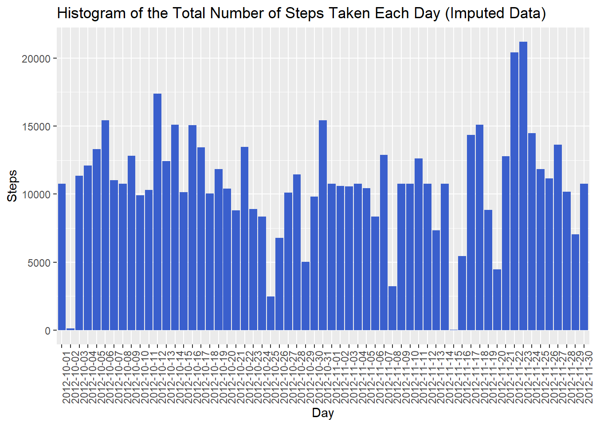
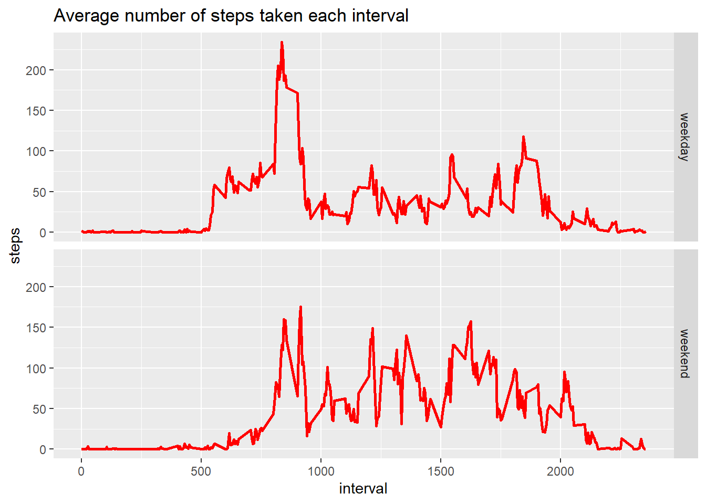

This assignment makes use of data from a personal activity monitoring device. This device collects data at 5 minute intervals through out the day. The data consists of two months of data from an anonymous individual collected during the months of October and November, 2012 and include the number of steps taken in 5 minute intervals each day.

The variables included in this dataset are:

 - **steps:** Number of steps taking in a 5-minute interval (missing values are coded as NA)
 - **date:** The date on which the measurement was taken in YYYY-MM-DD format
 - **interval:** Identifier for the 5-minute interval in which measurement was taken
 
 The dataset is stored in a comma-separated-value (CSV) file and there are a total of 17,568 observations in this dataset.
 

## Loading and preprocessing the data

Needed packages:


```r
library(ggplot2)
```

```
## Warning: package 'ggplot2' was built under R version 3.5.3
```

```r
library(lubridate)
```

```
## Warning: package 'lubridate' was built under R version 3.5.3
```
Code for reading in the dataset and/or processing the data


```r
download.file("https://d396qusza40orc.cloudfront.net/repdata%2Fdata%2Factivity.zip", destfile = "activity.zip")
unzip("activity.zip")
activity <- read.csv("activity.csv", stringsAsFactors=FALSE)
```
Histogram of the total number of steps taken each day


```r
stepsperday <- aggregate(steps ~ date, activity, FUN = sum)
ggplot(stepsperday, aes(steps))+
    geom_histogram(binwidth  = 2000)+
    xlab("Steps per day")+
    ggtitle("Histogram of the total number of steps taken each day")
```

<!-- -->
## What is mean total number of steps taken per day?

Mean and median number of steps taken each day


```r
meanstepsperday <- mean(stepsperday$steps)
mdianstepsperday <- median(stepsperday$steps)
print(paste0("Mean is ", meanstepsperday, ", and Median is ", mdianstepsperday))
```

```
## [1] "Mean is 10766.1886792453, and Median is 10765"
```
## What is the average daily activity pattern?

Time series plot of the average number of steps taken 


```r
stepsperinterval <- aggregate(steps ~ interval, activity, FUN = mean)
ggplot(data=stepsperinterval, aes(x=interval, y=steps))+
    geom_line(colour = "blue", size = 1)+
    ggtitle("Average number of steps taken")
```

<!-- -->

The 5-minute interval that, on average, contains the maximum number of steps


```r
maxsteps <- max(stepsperinterval$steps)
maxstepsinterval <- stepsperinterval$interval[which(stepsperinterval$steps == maxsteps)]
print(paste0("5 minute interval with max steps: ", maxstepsinterval))
```

```
## [1] "5 minute interval with max steps: 835"
```

## Imputing missing values

Code to describe and show a strategy for imputing missing data

Code to calculate the total number of missing values in the dataset, in order to impute the average.


```r
numNA <- nrow(activity) -nrow(activity[complete.cases(activity),])
imputedData <- activity
meanForNA <- aggregate(steps~interval,imputedData, FUN=mean)
for(i in 1:nrow(imputedData)){
  if(is.na(imputedData[i,c("steps")])){
    imputedData[i,c("steps")] <- meanForNA[meanForNA$interval==imputedData[i,c("interval")], c("steps")]
  }
}
```


Histogram of the total number of steps taken each day after missing values are imputed


```r
ggplot(imputedData,aes(as.factor(date),steps))+geom_bar(fill="royalblue3", stat="identity")+xlab("Day") + ylab("Steps")+ggtitle("Histogram of the Total Number of Steps Taken Each Day (Imputed Data)")+ theme(axis.text.x = element_text(angle = 90, hjust = 1))
```

<!-- -->

## Are there differences in activity patterns between weekdays and weekends?

Panel plot comparing the average number of steps taken per 5-minute interval across weekdays and weekends


```r
activity$date <- ymd(activity$date)
activity$wday <- wday(activity$date, label = T)
activity$we <- "weekday"
activity[activity$wday %in% c("Sun", "Sat"),5] <- "weekend"
weekdata <- aggregate(steps~interval + we, activity, FUN = mean)
```


```r
ggplot(data=weekdata, aes(x=interval, y=steps))+
    geom_line(colour = "red", size = 1)+
    facet_grid(we~.)+
    ggtitle("Average number of steps taken each interval")
```

<!-- -->


